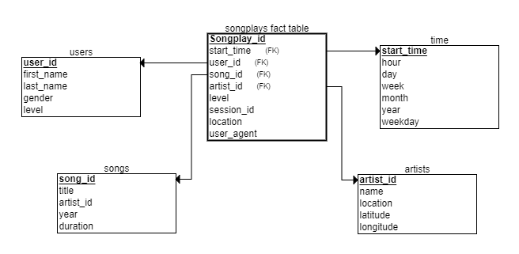

#  Data Modeling with Postgres & ETL Pipeline for Sparkify 
***
## Udacity Data Engineer Nano Degree Project 1
***
### Introduction

This project consists of creating a SQL analytics database for a fictional media company called Sparkify. Sparkify needs information about media playback such as which songs are played most, when they are played and how they are played when accessing your application. Currently the data is stored in Json logs and Sparkify needs this data to be available in a more practical and easy to access way.

### The goal
***
The objective is to create the database schema, load the data and implement the ETL pipeline for this project.

### Song Dataset
***
Songs dataset is a subset of [Million Song Dataset](http://millionsongdataset.com/).

Sample Record :
```
{"num_songs": 1, "artist_id": "ARJIE2Y1187B994AB7", "artist_latitude": null, "artist_longitude": null, "artist_location": "", "artist_name": "Line Renaud", "song_id": "SOUPIRU12A6D4FA1E1", "title": "Der Kleine Dompfaff", "duration": 152.92036, "year": 0}
```


### Log Dataset
***
Logs dataset is generated by [Event Simulator](https://github.com/Interana/eventsim).

Sample Record :
```
{"artist": null, "auth": "Logged In", "firstName": "Walter", "gender": "M", "itemInSession": 0, "lastName": "Frye", "length": null, "level": "free", "location": "San Francisco-Oakland-Hayward, CA", "method": "GET","page": "Home", "registration": 1540919166796.0, "sessionId": 38, "song": null, "status": 200, "ts": 1541105830796, "userAgent": "\"Mozilla\/5.0 (Macintosh; Intel Mac OS X 10_9_4) AppleWebKit\/537.36 (KHTML, like Gecko) Chrome\/36.0.1985.143 Safari\/537.36\"", "userId": "39"}
```


### Database & ETL pipeline
***
Using the song and log datasets, I create a star schema as shown below, which includes 
* one fact table: **songplays**, and 
* four dimension tables: **users**, **songs**, **artists** and **time**.




### Project Files
***
```sql_queries.py``` : Stores SQL statements to drop, create and load schema tables. <br>
```create_tables.py``` : Stores instructions for configuring the database. Running this file creates sparkifydb, the fact table and the dimension tables. <br>
```etl.ipynb``` : um notebook jupyter para o desenvolvimento e teste das instruções que serão utilizadas no processo de ETL. <br>
```etl.py``` : Performs the extraction, transformation and loading of data from the song_data and log_data files. <br>
```test.ipynb``` : a notebook to run SQL queries to check the records stored in the database tables.
### Examples queries
***
1. Number of times each song was played.<br>
SELECT song_id,count(*) FROM songplays GROUP BY song_id
2. Quantity of music per artist <br>
SELECT artist_id,count(song_id) FROM songplays GROUP BY artist_id
